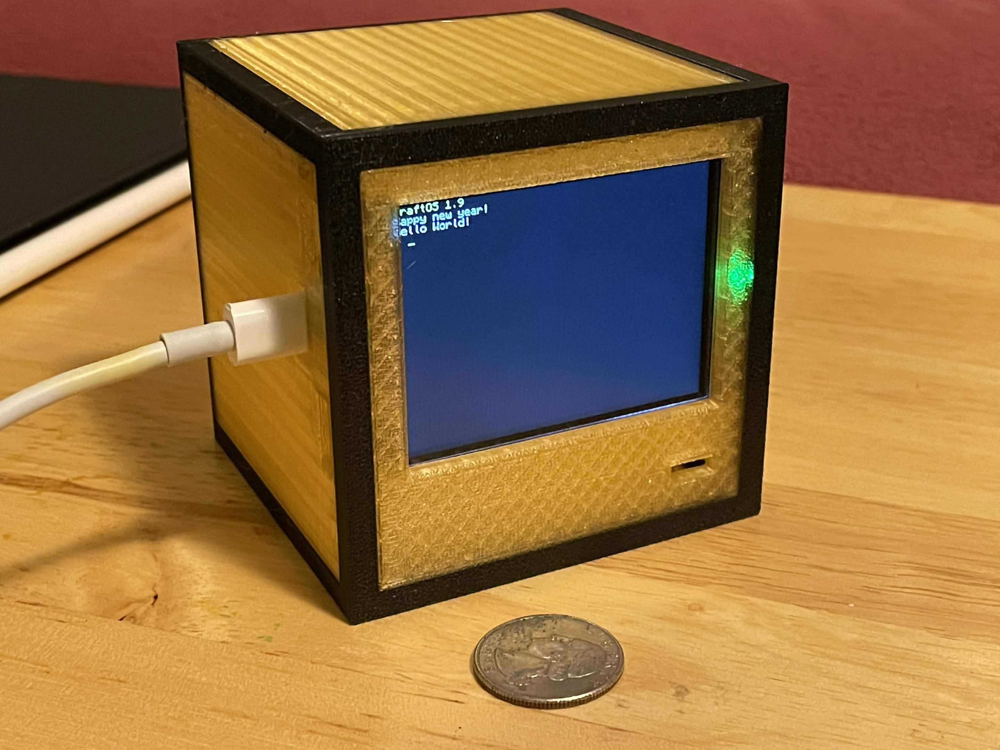
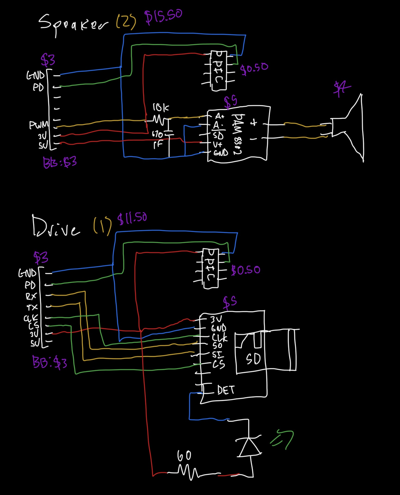
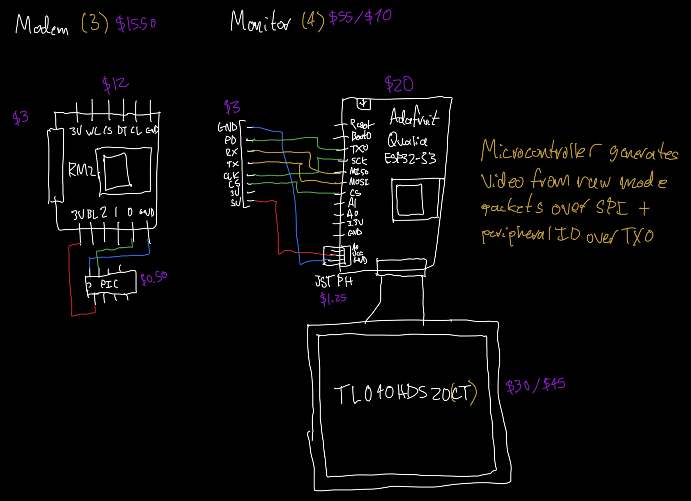

# craftos-pico2
A ComputerCraft emulator and operating system for Pi Pico 2, plus peripherals.

## Hardware
### Core
- Any RP2350-based board with:
  - On-board PSRAM - 2 MB minimum, 8 MB recommended
  - At least 4 MB of flash - the OS is on a 2 MB partition, and any extra space is available for user storage
  - Pimoroni Pico Plus 2 (W/LiPo) recommended as the I/O is designed around this board.
- Pimoroni Pico Display 2.8", or any ST7789-based 320x240 LCD on the same pins
- USB-C to USB-A adapter and keyboard
- Chopped up USB cable or port to provide 5V power

To be able to use USB devices (keyboard) you will need to power the board separately. Since the Pico Display is a backpack form factor, you can wrap the ends of wires around the VBUS and GND pins each while the Pico is pulled out a little, and then afterward fully seat the Pico in the socket. Then connect the wires to any 5V source. (If you're using the LiPo board then you shouldn't have to worry about this unless you want a separate charging port.)

### Peripherals
Peripherals communicate through the SP/CE ports on the Pico Plus 2 (GPIO 32-36) and the Pico Display 2.8" (GPIO 7-11). The usage of the pins varies depending on the peripheral type.

#### Peripheral ID
The BL pin on the connector (GPIO 7/36) is used for peripheral identification. This carries a "chirp" protocol similar in nature to UART, but is designed for syncing and is explicitly incompatible. The protocol runs at 488.28125 baud (1.000 MHz divided by 2048), active high, idle low, and has one high start bit, three data bits, and four low stop bits. The stop bits assure the decoder that if any of them are found to be high, the data read was not correct and the decoder resyncs starting at that bit.

The ID pin has a weak pull-up on the Pico side to enable chip detection - as soon as a peripheral is detached, it'll go high for > 8 bits and the OS will trigger a detach event in response. This means the ID chip can power off after chirping enough times for the OS to detect it.

The peripheral ID code in `PeripheralID.X` is designed for low-end PIC chips down to the PIC10F200, but any microcontroller (or even TTL logic) can be used. For example, the monitor's ESP32-S3 driver outputs the chirp itself in parallel with the display code. Assume all peripherals require one of these chips unless otherwise specified.

#### Drive (ID 1)
- (micro)SD card slot breakout with SPI pinout
- For light: Green LED and 60Ω resistor, and a breakout with a detection switch

#### Speaker (ID 2)
- Audio amplifier (PAM8302 recommended)
- Speaker cone
- For PWM filtering: 10kΩ resistor and 680 pF capacitor

#### Modem (ID 3)
- RM2 modem (Pimoroni breakout with SP/CE recommended)

#### Monitor (ID 4)
- Adafruit Qualia ESP32-S3
- TL040HDS20(CT) display (720x720 3" RGB666 TTL display, optionally with capacitive touch)
- 3-pin JST PH connector required for non-USB power
- External microcontroller not required

#### Printer (ID 5)
- ESC/POS-compatible receipt printer with RS-232 interface
- RS-232 to TTL UART level shifter supporting 3.3V logic levels (MAX3232 or MAX3243 recommended)

### Cases
Model files for 3D printing are in `models` in FreeCAD format, which can be exported to STL/STEP for printing. Different colored sections are different bodies, so make sure to export each body individually and then combine them with different colors when printing.

## License
MIT
